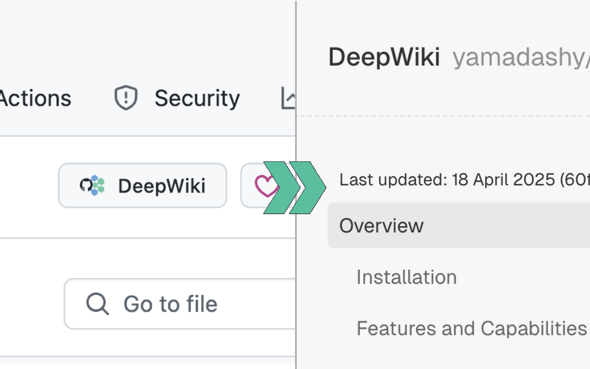

<div align="center">
  
  <h3>GitHub DeepWiki Button</h3>
  <b>A browser extension that adds a DeepWiki button to GitHub repositories</b>
</div>



[![DeepWiki](https://img.shields.io/badge/DeepWiki-yamadashy%2Fgithub--deepwiki-blue.svg?logo=data:image/png;base64,iVBORw0KGgoAAAANSUhEUgAAACwAAAAyCAYAAAAnWDnqAAAAAXNSR0IArs4c6QAAA05JREFUaEPtmUtyEzEQhtWTQyQLHNak2AB7ZnyXZMEjXMGeK/AIi+QuHrMnbChYY7MIh8g01fJoopFb0uhhEqqcbWTp06/uv1saEDv4O3n3dV60RfP947Mm9/SQc0ICFQgzfc4CYZoTPAswgSJCCUJUnAAoRHOAUOcATwbmVLWdGoH//PB8mnKqScAhsD0kYP3j/Yt5LPQe2KvcXmGvRHcDnpxfL2zOYJ1mFwrryWTz0advv1Ut4CJgf5uhDuDj5eUcAUoahrdY/56ebRWeraTjMt/00Sh3UDtjgHtQNHwcRGOC98BJEAEymycmYcWwOprTgcB6VZ5JK5TAJ+fXGLBm3FDAmn6oPPjR4rKCAoJCal2eAiQp2x0vxTPB3ALO2CRkwmDy5WohzBDwSEFKRwPbknEggCPB/imwrycgxX2NzoMCHhPkDwqYMr9tRcP5qNrMZHkVnOjRMWwLCcr8ohBVb1OMjxLwGCvjTikrsBOiA6fNyCrm8V1rP93iVPpwaE+gO0SsWmPiXB+jikdf6SizrT5qKasx5j8ABbHpFTx+vFXp9EnYQmLx02h1QTTrl6eDqxLnGjporxl3NL3agEvXdT0WmEost648sQOYAeJS9Q7bfUVoMGnjo4AZdUMQku50McDcMWcBPvr0SzbTAFDfvJqwLzgxwATnCgnp4wDl6Aa+Ax283gghmj+vj7feE2KBBRMW3FzOpLOADl0Isb5587h/U4gGvkt5v60Z1VLG8BhYjbzRwyQZemwAd6cCR5/XFWLYZRIMpX39AR0tjaGGiGzLVyhse5C9RKC6ai42ppWPKiBagOvaYk8lO7DajerabOZP46Lby5wKjw1HCRx7p9sVMOWGzb/vA1hwiWc6jm3MvQDTogQkiqIhJV0nBQBTU+3okKCFDy9WwferkHjtxib7t3xIUQtHxnIwtx4mpg26/HfwVNVDb4oI9RHmx5WGelRVlrtiw43zboCLaxv46AZeB3IlTkwouebTr1y2NjSpHz68WNFjHvupy3q8TFn3Hos2IAk4Ju5dCo8B3wP7VPr/FGaKiG+T+v+TQqIrOqMTL1VdWV1DdmcbO8KXBz6esmYWYKPwDL5b5FA1a0hwapHiom0r/cKaoqr+27/XcrS5UwSMbQAAAABJRU5ErkJggg==)](https://deepwiki.com/yamadashy/github-deepwiki)
<!-- DeepWiki badge generated by https://deepwiki.ryoppippi.com/ -->

## 🚀 Get Started

### Install

- Chrome: [GitHub DeepWiki - Chrome Web Store](https://chromewebstore.google.com/detail/github-deepwiki-unofficia/agchcjkheangfiopepndmenabbaopnpp)
- Firefox: [GitHub DeepWiki - Firefox Add-ons](https://addons.mozilla.org/ja/firefox/addon/github-deepwiki-unofficial/)
- Edge: Pending

### What is DeepWiki?

[DeepWiki](https://deepwiki.com) is a powerful AI documentation tool by Cognition. It generates comprehensive documentation for any GitHub repository and allows you to chat with it - all for free for open-source projects!

Just change `github.com` to `deepwiki.com` in any repository URL to access it.

## 🔒 Privacy Policy

GitHub DeepWiki Button does not collect any data.

In the future, GitHub DeepWiki Button may add the ability to save user settings on your device, but that data will not be sent to the server.

In addition, the GitHub DeepWiki Button management account will not be transferred to a third party.

If you have any questions or inquiries regarding the privacy policy, please contact koukun0120@gmail.com.

Revised: April 29, 2025

## 💻 Development

Node.js 22 or higher is required for development.

### Setup

1. Clone the repository:
   ```sh
   git clone https://github.com/yamadashy/github-deepwiki.git
   cd github-deepwiki
   ```
2. Install Node.js 22 or higher ([Node.js official site](https://nodejs.org/) or [nvm](https://github.com/nvm-sh/nvm) is recommended).
3. Install dependencies:
   ```sh
   npm install
   ```
4. Start the development server:
   ```sh
   npm run dev
   ```

### Main Commands

Development extension for each browser.

```sh
npm run dev chrome
npm run dev firefox
npm run dev edge
```

Build extension for each browser.

```sh
npm run build chrome
npm run build firefox
npm run build edge
```

Lint code.

```sh
npm run lint
```

## 📜 License

This project is licensed under the [MIT License](LICENSE).
